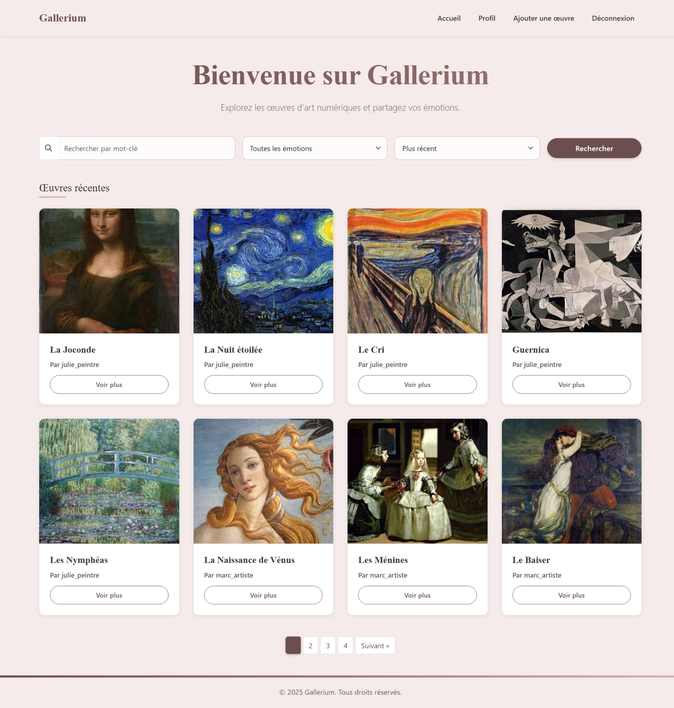
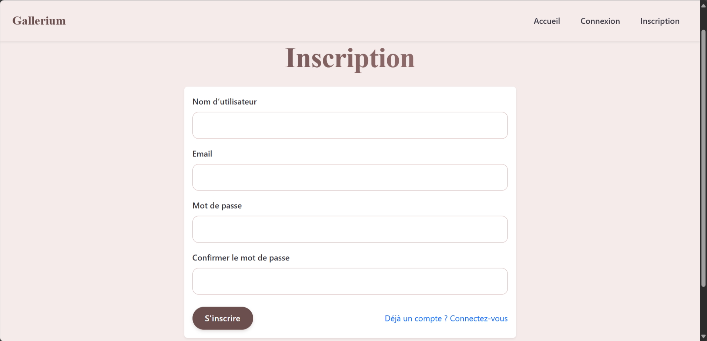
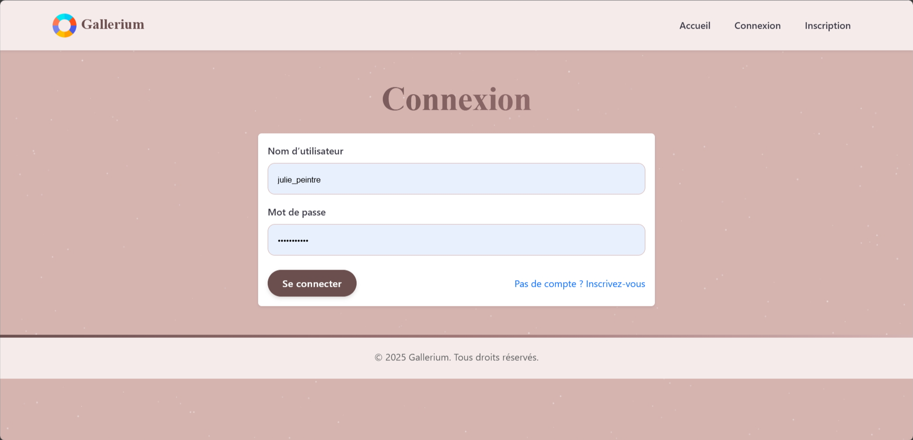
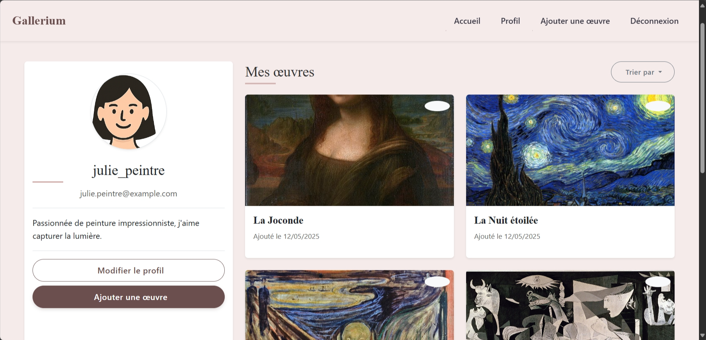
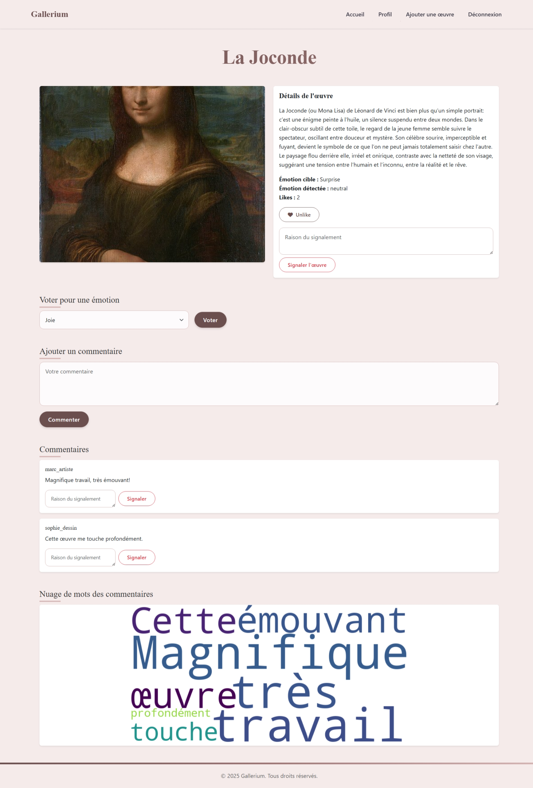
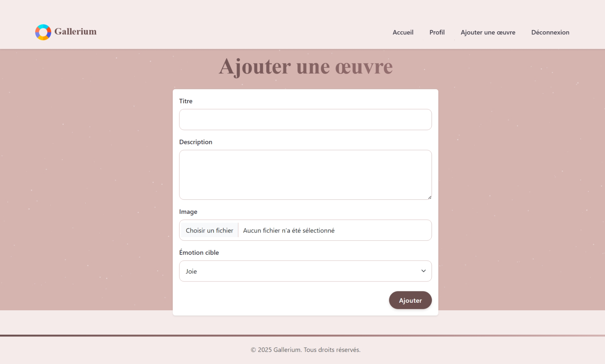
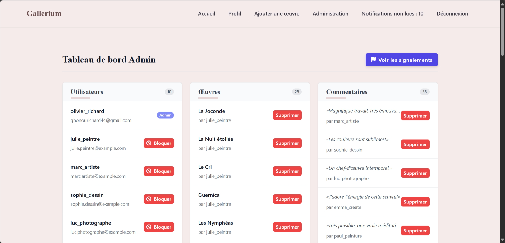
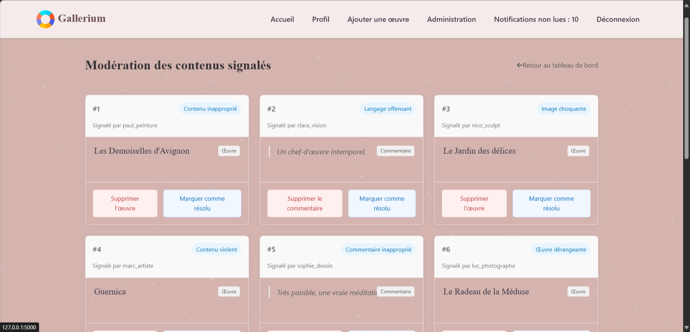
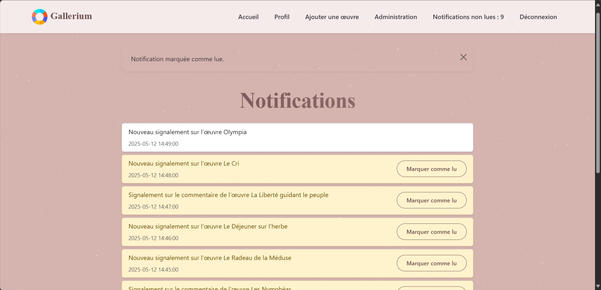

::: {align="center"}
<h1>Gallerium - Plateforme Web d'Art Numérique</h1>


<p><strong>Une plateforme interactive pour partager, découvrir et
interagir avec des œuvres d'art numériques.</strong></p>

<p><a href="https://github.com/OlivierGBONOU/Gallerie-d-Art-Num-rique-avec-IA"></a>
<a href="https://sites.google.com/view/gbonou-olivier/accueil"></a></p>
:::

------------------------------------------------------------------------

## À Propos

**Gallerium** est une application web innovante développée avec
**Flask** (Python) pour permettre aux utilisateurs de partager des
œuvres d'art numériques, d'interagir via des likes, commentaires et
votes émotionnels, et d'explorer des créations grâce à une recherche
avancée. Dotée d'une analyse automatique des émotions basée sur un
modèle NLP et d'un panneau d'administration robuste, Gallerium offre une
expérience utilisateur fluide et sécurisée.

**Auteur** : GBONOU Kossi Olivier Richard\
**Rôle** : Étudiant Analyste Statisticien\
**Email** :
[richard.gbonou\@ensea.edu.ci](mailto:richard.gbonou@ensea.edu.ci)\
**Portfolio** :
[gbonou-olivier](https://sites.google.com/view/gbonou-olivier/accueil)

------------------------------------------------------------------------

## Fonctionnalités

Gallerium combine des fonctionnalités riches pour les utilisateurs et
les administrateurs, conçues pour une expérience immersive et intuitive
:

### Pour les Utilisateurs

-   **Inscription & Connexion** : Créez un compte sécurisé ou
    connectez-vous avec hachage des mots de passe (`pbkdf2:sha256`).
-   **Profil Personnalisé** : Gérez votre bio, avatar et consultez vos
    œuvres publiées.
-   **Upload d'Œuvres** : Publiez des images (JPEG/PNG) avec titre,
    description et émotion cible (Joie, Tristesse, etc.).
-   **Interactions Sociales** :
    -   **Likes** : Aimez ou retirez votre like sur une œuvre.
    -   **Votes Émotionnels** : Votez pour associer une émotion à une
        œuvre.
    -   **Commentaires** : Ajoutez des commentaires et visualisez un
        nuage de mots généré automatiquement.
    -   **Signalements** : Signalez des contenus inappropriés avec
        justification.
-   **Recherche Avancée** : Filtrez par mot-clé, émotion ou tri (date,
    likes) avec pagination intuitive.
-   **Analyse des Émotions** : Analyse automatique des descriptions via
    un modèle NLP (`j-hartmann/emotion-english-distilroberta-base`).

### Pour les Administrateurs

-   **Tableau de Bord** : Vue d'ensemble des utilisateurs, œuvres et
    commentaires avec actions rapides (bannir, supprimer).
-   **Modération** : Traitez les signalements en supprimant ou résolvant
    les contenus.
-   **Notifications** : Recevez des alertes par interface et email pour
    les nouveaux signalements.
-   **Sécurité** : Accès restreint aux administrateurs via décorateurs
    personnalisés.

------------------------------------------------------------------------

## Architecture

Gallerium suit une structure modulaire pour une maintenance et une
évolutivité optimales.

### Structure des Dossiers

```         
gallerium/
├── app/
│   ├── routes/                # Routes Flask organisées par fonctionnalité
│   │   ├── admin.py           # Gestion admin
│   │   ├── auth.py            # Authentification
│   │   ├── interactions.py    # Likes, votes, commentaires
│   │   ├── main.py            # Accueil, recherche
│   │   ├── user.py            # Profil, œuvres
│   ├── static/                # Fichiers statiques
│   │   ├── css/style.css
│   │   ├── images/
│   │   ├── uploads/           # Images téléchargées
│   ├── templates/             # Templates HTML (Jinja2)
│   │   ├── admin/
│   │   ├── artwork.html
│   │   ├── base.html
│   │   ├── index.html
│   │   ├── login.html
│   │   ├── profile.html
│   ├── utils/                 # Fonctions utilitaires
│   │   ├── emotion_analysis.py
│   │   ├── image_processing.py
│   │   ├── wordcloud_generator.py
│   ├── __init__.py            # Initialisation Flask
│   ├── forms.py               # Formulaires Flask-WTF
│   ├── models.py              # Modèles SQLAlchemy
├── tests/                     # Tests unitaires
│   ├── test_models.py
│   ├── test_routes.py
├── .gitignore
├── config.py                  # Configuration principale
├── README.md
├── requirements.txt           # Dépendances
├── run.py                     # Script de lancement
```

### Technologies Utilisées

-   **Backend** : Flask, SQLAlchemy, Flask-Login, Flask-WTF, Flask-Mail,
    Flask-Migrate
-   **Frontend** : Bootstrap 5, Jinja2, Font Awesome
-   **Analyse NLP** : Transformers (Hugging Face)
-   **Traitement d'Images** : Pillow
-   **Visualisation** : WordCloud
-   **Tests** : Pytest
-   **Base de Données** : SQLite (configurable pour PostgreSQL)

------------------------------------------------------------------------

## Prérequis

Pour compiler et exécuter Gallerium, assurez-vous d'avoir :

-   **Python** : 3.8 ou supérieur
-   **pip** : Gestionnaire de paquets Python
-   **Virtualenv** : Recommandé pour isoler les dépendances
-   **SQLite** : Inclus avec Python (ou autre DB via configuration)
-   **Serveur SMTP** : Mailtrap pour les tests (ou autre en production)

### Dépendances

Installez les bibliothèques listées dans `requirements.txt` :

``` bash
pip install -r requirements.txt
```

**Principales dépendances** : - Flask, Flask-SQLAlchemy, Flask-Login,
Flask-WTF - transformers, Pillow, wordcloud - pytest, python-dotenv

------------------------------------------------------------------------

## Installation et Compilation

Suivez ces étapes pour compiler et lancer Gallerium localement :

### 1. Cloner le Projet

``` bash
git clone https://github.com/OlivierGBONOU/Gallerie-d-Art-Num-rique-avec-IA.git
cd gallerium
```

### 2. Créer un Environnement Virtuel

``` bash
python -m venv venv
source venv/bin/activate  # Linux/Mac
venv\Scripts\activate     # Windows
```

### 3. Installer les Dépendances

``` bash
pip install -r requirements.txt
```

### 4. Configurer les Variables d'Environnement

Créez un fichier `.env` à la racine du projet :

``` env
SECRET_KEY=your_secret_key
DATABASE_URL=sqlite:///gallerium.db
MAIL_SERVER=smtp.mailtrap.io
MAIL_PORT=2525
MAIL_USERNAME=your_mailtrap_username
MAIL_PASSWORD=your_mailtrap_password
MAIL_DEFAULT_SENDER=your_email@example.com
```

> **Note** : Remplacez les valeurs par vos propres clés (Mailtrap pour
> les tests).

### 5. Lancer l'Application

``` bash
python run.py
```

Accédez à l'application sur :\
🌐 [**http://127.0.0.1:5000**](http://127.0.0.1:5000)

------------------------------------------------------------------------

## Utilisation

### Interface Utilisateur

-   **Accueil** : Parcourez les œuvres récentes ou filtrez via la
    recherche avancée.\
    
-   **Inscription/Connexion** : Créez un compte ou connectez-vous.\
    
    
-   **Profil** : Gérez vos œuvres et informations personnelles.\
    
-   **Œuvres** : Publiez, commentez, votez ou signalez.\
    
    

### Interface Admin

Connectez-vous avec le compte admin par défaut :\
- **Nom d'utilisateur** : `olivier_richard`\
- **Mot de passe** : `Oliviertyui2004`

-   **Tableau de Bord** : Gérez utilisateurs et contenus.\
    
-   **Modération** : Traitez les signalements.\
    
-   **Notifications** : Consultez les alertes.\
    

------------------------------------------------------------------------

## Tests

Exécutez les tests unitaires pour valider les fonctionnalités :

``` bash
pytest
```

Les tests couvrent : - Modèles (`User`, `Artwork`, `Emotion`, etc.) -
Routes principales (accueil, profil, upload, etc.)

> **Note** : Les tests utilisent une base de données en mémoire et
> désactivent le CSRF.

------------------------------------------------------------------------

## Sécurité

Gallerium intègre des mesures robustes : - **Hachage des Mots de Passe**
: `pbkdf2:sha256` - **Protection CSRF** : Flask-WTF - **Sanitisation** :
Prévention des injections XSS/SQL - **Validation des Fichiers** :
JPEG/PNG uniquement, redimensionnés à 800x800 - **Autorisations** :
Accès restreint via décorateurs

------------------------------------------------------------------------

## Limitations et Améliorations

### Limitations

-   Analyse NLP limitée aux émotions prédéfinies.
-   SQLite inadapté pour une charge importante.
-   Tests unitaires à compléter avec des tests d'intégration.

### Améliorations Futures

-   Analyse émotionnelle des images via vision par ordinateur.
-   Messagerie privée entre utilisateurs.
-   Statistiques visuelles (graphiques des émotions).
-   Migration vers PostgreSQL.
-   Notifications en temps réel (WebSockets).

------------------------------------------------------------------------

## Contribution

1.  Forkez le projet.
2.  Créez une branche : `git checkout -b feature/nouvelle-fonction`.
3.  Committez : `git commit -m "Ajout de fonctionnalité"`.
4.  Poussez : `git push origin feature/nouvelle-fonction`.
5.  Soumettez une Pull Request.

Respectez **PEP 8** et ajoutez des tests pour vos contributions.

------------------------------------------------------------------------

## Crédits

-   **Framework** : Flask, Bootstrap 5
-   **Bibliothèques** : Transformers, Pillow, WordCloud
-   **Icônes** : Font Awesome, Bootstrap Icons
-   **Auteur** : GBONOU Kossi Olivier Richard

------------------------------------------------------------------------

## Licence

Aucune licence spécifiée.

------------------------------------------------------------------------

::: {align="center"}
<p><strong>Explorez, partagez, et laissez votre créativité s'exprimer
avec Gallerium !</strong></p>

<p><a href="https://github.com/OlivierGBONOU/Gallerie-d-Art-Num-rique-avec-IA">Commencez
maintenant 🚀</a></p>
:::
